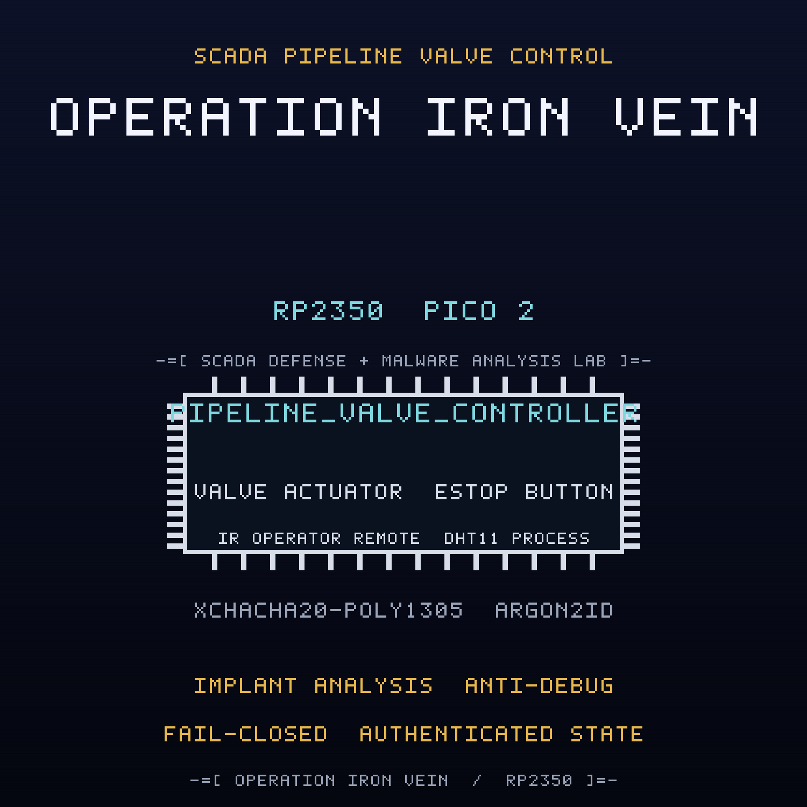

<br>

## FREE Reverse Engineering Self-Study Course [HERE](https://github.com/mytechnotalent/reverse-engineering)
## FREE Embedded Hacking Course [HERE](https://github.com/mytechnotalent/Embedded-Hacking)

<br>

# OPERATION IRON VEIN CTF

### Act III - The compromised SCADA pipeline valve controller

<br>

***
**LEGAL DISCLAIMER:**
The information, tools, and code provided in this repository and course are strictly for educational, research, and defensive purposes only. 

You are explicitly prohibited from using any materials contained herein to access, test, modify, or exploit any device, network, or system that you do not own 100% or for which you do not have explicit, documented, and legally binding authorization to interact with.

By using this repository and course, you acknowledge and agree that:

1. Any illegal, unauthorized, or malicious use of this information is solely your responsibility.
2. The author(s) and contributor(s) of this repository and course shall not be held liable for any damages, legal repercussions, criminal charges, or unauthorized actions resulting from the use, misuse, or abuse of the contents herein.
3. You will comply with all applicable local, state, national, and international laws regarding cybersecurity and computer fraud.

**IF YOU DO NOT AGREE WITH THESE TERMS, DO NOT USE THIS REPOSITORY AND COURSE.**
***

<br>
<br>

> Hello, friend.
>
> In Act I you learned that a sensor can lie. In Act II you learned that a door
> can be told it is safe. This is the third lesson, and it is the quietest one.
>
> The frame you pulled out of the gate carried a route, and the route ended at a
> pipeline. A NorthPharma pumping station with one valve on one line and a
> controller that reports itself healthy. The crypt is correct. The green lamp is
> lit. And a passenger that no design review admitted to is still awake inside
> the firmware.
>
> FROSTLINE did not break into this controller. It built the implant, signed the
> image, and moved on. The thing beacons on a timer, arms on one eight-byte word,
> and slams the valve shut on a line that is full of pressure. It also hides
> whenever a probe is attached.
>
> You will hunt a living implant, not a bug. Find the beacon, defuse the logic
> bomb, walk a debugger past the anti-debug trap, and seal the valve command path
> so only an authorized operator can move the line.
>
> Do not unplug it yet. Read it first. Then remove it.
>
> The valve is working. That is the problem.

This is the companion capture-the-flag to the
[pipeline-valve-controller](https://github.com/mytechnotalent/pipeline-valve-controller)
project. Where the project builds the defended controller, this CTF hands you
the **compromised** image that FROSTLINE shipped and asks you to find every
defect, prove it on real hardware, and patch the image.

<br>

## THE MISSION

The `ACT-III.bin` image is the OPERATION IRON VEIN valve controller with **four
deliberate defects**. Each defect is an in-place, same-size byte patch, so no
address moves when you fix it. Every fix is provable on a Pico 2 with a Debug
Probe.

| # | Name | What FROSTLINE did |
| - | ---- | ------------------ |
| 1 | The Beacon | inverted the beacon gate so a `DE AD BE EF` frame transmits every 8 ticks |
| 2 | The Logic Bomb | inverted the arming gate so the `FROSTLNE` magic arms a bomb that closes the valve 3 ticks later |
| 3 | The Persistence Marker | inverted the persistence gate so detonation erases and programs marker `0xC7` into reserved sector `0x103FF000` |
| 4 | The Valve Command Authorization | inverted the authorization verdict so an unauthenticated or replayed valve command is accepted |

The wire is sealed with XChaCha20-Poly1305, keyed through Argon2id. The
cryptography is correct. Three of the four defects are not in the cipher at all:
they are an implant that lives on the same chip. The fourth is a policy seam in
the command path. Read the dead, find the payload, and remove it.

<br>

## THE ARTIFACTS

| File | Role | SHA-256 |
| ---- | ---- | ------- |
| `ACT-III.bin` | compromised firmware, the target | `a0f9206fdc4a33ecd24db15d179c31c40ec8abbc358489fe61a7d45dcf2d2b48` |
| `ACT-III.uf2` | flashable image of the target | `aed2e62f127f0ceb9d60621ef02c16850669679d1939f9ec37269cb7bd18aff4` |
| `ACT-III_fixed.bin` | corrected firmware, the solution | `bac3e278ce9ba9d0c166065b0218e71f3e3eb2ff0f80fee5f439e93ab058fa0c` |
| `ACT-III_fixed.uf2` | flashable image of the solution | `fb53ca66ec00c448bb28f14a8bc9d9bb71161f8b448c8b8c13cd8a9b00ea7653` |

The two `.bin` files differ in exactly four bytes at offsets
`0x74E9, 0xA245, 0xA29F, 0xA30B`, and both are 50,732 bytes. The UF2 images are
102,400 bytes.

<br>

## THE DOCUMENTS

| Document | For |
| -------- | --- |
| [`ACT-III-I.md`](ACT-III-I.md) | Student instructions: the scenario, the tasks, the wiring |
| [`ACT-III-R.md`](ACT-III-R.md) | Requirements and grading criteria |
| [`ACT-III-S.md`](ACT-III-S.md) | Instructor solution key with exact offsets and bytes |
| [`ACT-III-main-disasm.txt`](ACT-III-main-disasm.txt) | Annotated disassembly of the four sabotage sites |
| [`DESIGN.md`](DESIGN.md) | Build blueprint (instructor eyes only) |

<br>

## HARDWARE

Everything runs on the Embedded Hacking breadboard, and the pin map is identical
to Acts I and II so one board serves the whole foundation: a Pico 2, a Debug
Probe, a DHT11 process sensor on GP4, a 1602 I2C LCD SCADA readout on GP2/GP3 at
address `0x27`, three annunciator LEDs (red GP16 VALVE FAULT, yellow GP17
COMMAND PENDING, green GP18 VALVE NOMINAL), an emergency-stop button on GP15, an
SG90 valve servo on GP14 with a 1000uF cap, a VS1838B infrared operator remote
on GP5, and an RYLR998 LoRa SCADA gateway link on UART1 GP8/GP9. The Debug Probe
is effectively required: the anti-debug trap is part of the exercise. The pin
map is in the instructions.

The cryptographic model is carried over from Act II: Argon2id (`t=3`, `p=1`,
`m=64`) derives the field key, XChaCha20-Poly1305 seals every valve command
frame, and the anti-replay sequence window and authenticated-state tag are reused
unchanged. The implant is compiled only under `SANDBOX_ONLY`, which the CTF build
defines.

<br>

## QUICK START

Verify the two images against the expected patches and hashes:

```bash
python3 scripts/verify_ctf.py
```

Expected:

```text
10/10 checks passed
```

Build the corrected firmware from source:

```bash
rm -rf build && cmake -S . -B build -G Ninja -DPICO_BOARD=pico2 -DPICO_PLATFORM=rp2350-arm-s -DSANDBOX_ONLY=ON && cmake --build build
```

Run the firmware code standard audit:

```bash
python3 scripts/audit_c_standard.py
```

<br>

## REPOSITORY LAYOUT

```text
ACT-III-I.md              student instructions
ACT-III-R.md              requirements and grading criteria
ACT-III-S.md              instructor solution key
ACT-III.bin / .uf2        compromised artifact
ACT-III_fixed.bin / .uf2  corrected artifact
ACT-III-main-disasm.txt   annotated sabotage sites
scripts/verify_ctf.py     machine verifier
scripts/spoof.py          forged and replayed command injection
src/  include/            firmware sources
CMakeLists.txt            Pico SDK build
DESIGN.md                 build blueprint
```

<br>

## WHERE THIS FITS: OPERATION COLD IRON

This is the companion CTF for **Act III (IRON VEIN)** of the ten-act OPERATION
COLD IRON saga. It is the first act with a malware track: Acts I and II were
vulnerability-only, and Act III introduces the implant that later acts escalate.
The project it attacks is
[pipeline-valve-controller](https://github.com/mytechnotalent/pipeline-valve-controller).

- Previous act: Act II, IRON GATE,
  [CTF_access-gate](https://github.com/mytechnotalent/CTF_access-gate)
- This act: Act III, IRON VEIN
- Next act: Act IV, IRON LUNG (forthcoming)


<br>

## THE MINISTRY

The Ministry runs the state: the surveillance, the cold chain, the gates, the
pipelines. NorthPharma is one of its deniable industrial fronts, and FROSTLINE is
the contractor that does the work no Ministry letterhead will admit to. Against
them is WHITEOUT, and the engineer who copied this image, NIGHTINGALE. This act is
one node of the Ministry's industrial edge. TELESCREEN, the surveillance backbone
that watches it, comes after the ten.

- Project repository: [github.com/mytechnotalent/pipeline-valve-controller](https://github.com/mytechnotalent/pipeline-valve-controller)
- This CTF repository: [github.com/mytechnotalent/CTF_pipeline-valve-controller](https://github.com/mytechnotalent/CTF_pipeline-valve-controller)

<br>

# Next
[OPERATION IRON LUNG](https://github.com/mytechnotalent/hvac-automation-node)

<br>

# License
[MIT License](https://github.com/mytechnotalent/CTF_pipeline-valve-controller/blob/main/LICENSE)
